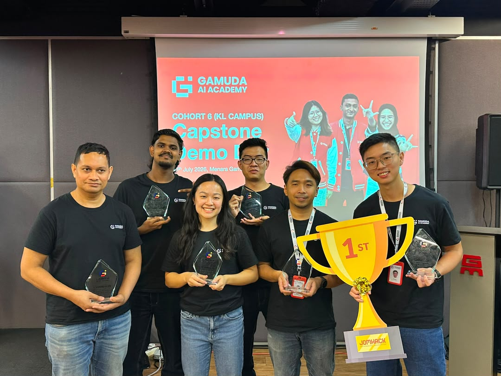

# Baymax

> 🏆 **1st Place — Gamuda AI Academy Capstone Demo Day**
> Team Penta V · Cohort 6, KL Campus · July 2026 · Menara Gamuda



**Baymax is an AI-powered Chrome Extension that walks developers through deploying to Google Cloud Platform — by highlighting the exact button to click, on the live GCP Console.**

Pick a task ("Host a backend on Cloud Run"), and Baymax opens in the side panel and guides you step by step: it finds the real element on the page, draws a highlight around it, and advances when you click. When you get stuck, you can ask it a question — and it can see the page you are looking at.

Built on LangChain + Gemini, with curated guides for Cloud Run, Cloud SQL, and IAM.

> **About this repo.** Baymax was originally built by **Team Penta V** — Aidi, Benny, Raegen, Kuberan, Annabelle, and Isyraf — as our Gamuda AI Academy capstone. This copy is maintained by [Isyraf](https://github.com/yapsancode) as a personal continuation for his portfolio, and does not carry the original team's commit history. The full team history lives in the original repo.

---

## What it does

- **Step-by-step overlay** — highlights the actual button or field on the Console, in whichever frame it lives in.
- **Curated guides** — hand-written, tested flows (e.g. the 9-step Cloud Run deployment) that always win over AI-generated ones.
- **AI chat** — ask a question in plain language. Baymax either answers, or hands back a deployment plan you can run as a guide.
- **Page-aware answers** — chat can include a summary and screenshot of the Console tab, so "what does this graph mean?" actually works.
- **Voice guide** — steps read aloud in the Baymax voice (Gemini TTS), with a browser-speech fallback.
- **Recorder** — record your own click-through of a Console flow and save it as a reusable guide.
- **Progress tracking** — sessions and steps are saved, so you can stop and resume.

---

## Repository layout

This is a **monorepo** with three deployable units. They share nothing at runtime — they talk only over HTTP — so each one builds, versions, and deploys independently.

| Directory | What it is | Ships to |
|---|---|---|
| [`baymax-extension/`](baymax-extension) | The Chrome Extension (Manifest V3, Vite + React 19) | Chrome Web Store |
| [`baymax-backend/`](baymax-backend) | The FastAPI service (LangChain + Gemini) | Google Cloud Run |
| [`baymax-marketing/`](baymax-marketing) | The standalone marketing website (Vite + React) | Static build |

There is also [`learning/`](learning) — the curriculum material written alongside the project.

---

## How it works

Two ways a guide starts, both from the side panel:

```
A) Quick-start chip (curated guide)          B) Chat question (AI or curated)
   GET /guides → GET /guides/{id}               POST /chat  (streamed as SSE)
        |                                            |
   official guide fetched from the DB           an official guide is matched first, with no LLM;
   (offline bundled copy only on failure)       otherwise Gemini either replies in text OR returns
                                                a deployment plan. A plan that matches an official
                                                guide is intercepted — the curated guide wins.
        |                                            |
        +--------------------+-----------------------+
                             |
        user starts the guide → POST /sessions + POST /sessions/{id}/steps
                             |
        the side panel sends each step to the content script, broadcast to every
        frame (the Console renders most pages inside a same-origin iframe)
                             |
        the content script scores every visible candidate by role / accessible name /
        text / href and highlights the best match above a confidence threshold
                             |
        the step completes on your click, your input, or a URL change;
        progress is saved with PATCH .../steps/{step_id}
```

**Steps are intents, not selectors.** A step carries `{ selector, role, name, text, href, ... }` and the overlay picks the best live match. Failing to "not found" and retrying beats highlighting the wrong button.

---

## Getting started

You need **Node 20+**, **Python 3.12**, and a Chrome-based browser.

### 1. Backend

```bash
cd baymax-backend
python -m venv venv
source venv/Scripts/activate    # Windows bash;  use venv/bin/activate on macOS/Linux
pip install -r requirements.txt
uvicorn main:app --reload
```

The API is then at `http://127.0.0.1:8000` (docs at `/docs`).

Create a `.env` file in `baymax-backend/` first — **never commit it**:

```
DATABASE_URL=            # postgresql://...  (Supabase → Project Settings → Database)
SUPABASE_URL=            # https://<project-id>.supabase.co
SUPABASE_SECRET_KEY=     # sb_secret_... (Supabase → Settings → API Keys)
SUPABASE_JWKS_URL=       # https://<project-id>.supabase.co/auth/v1/.well-known/jwks.json
GEMINI_API_KEY=          # Gemini API key
ALLOWED_ORIGINS=         # comma-separated, e.g. chrome-extension://<id>,http://localhost:5173
```

Optional settings (model names, rate limits, TTS voice, LangSmith tracing) all have sensible defaults — see `config.py`.

> `DATABASE_URL` is the **Postgres connection string**; `SUPABASE_URL` is the **https project API URL**. They are different — don't mix them up.

Run the tests with:

```bash
pytest tests/
```

### 2. Extension

```bash
cd baymax-extension
npm install
npm run build
```

Then load it in Chrome:

1. Go to `chrome://extensions`
2. Enable **Developer mode**
3. Click **Load unpacked**
4. Select `baymax-extension/dist/`

Reload the extension there after every rebuild.

For UI work without the Console, `npm run dev` runs a normal Vite dev server.

Create `.env.local` in `baymax-extension/`:

```
VITE_API_BASE_URL=              # defaults to http://127.0.0.1:8000
VITE_SUPABASE_URL=
VITE_SUPABASE_PUBLISHABLE_KEY=  # publishable key only — never the secret key
```

> The `chrome-extension://<id>` origin must be listed in the backend's `ALLOWED_ORIGINS`, or CORS will block every request.

### 3. Marketing site

```bash
cd baymax-marketing
npm install
npm run dev
```

---

## Running the backend in Docker

The `Dockerfile` pins Python 3.12 and the exact dependencies, so local runs match Cloud Run.

```bash
cd baymax-backend
docker build -t baymax-backend .
docker run --rm -p 8080:8080 --env-file .env baymax-backend
```

The container listens on `$PORT` (default **8080**), which is what Cloud Run expects. `.env` is excluded from the image — pass it at run time locally, and set the variables in the Cloud Run service config in production.

---

## Architecture notes

### Backend layers

Each concern has one home. Don't mix them.

| Layer | Lives in | Responsibility |
|---|---|---|
| HTTP | `routers/` | Thin endpoints — declare the schema, call `db_call`, return |
| API shape | `schemas/` | Pydantic request/response models only |
| DB shape | `models.py` | SQLAlchemy ORM (`User`, `Session`, `Step`, `RecordedGuide`) |
| Database | `db_call.py` | Every read and write. Routers never run SQL themselves |
| Outside world | `services/` | Supabase and Gemini calls only |
| Settings | `config.py` | The one typed place every env var is read |

Two more rules that matter:

- **LangChain orchestrates Gemini** — don't call the Gemini SDK directly. (The one sanctioned exception is `tts_service.py`, because LangChain has no support for Gemini's audio response modality.)
- **JWTs are verified via JWKS**, not a shared secret. The signing key is ES256; `ES256` and `RS256` are both accepted so key rotation doesn't break auth.

### Extension contexts

The extension runs in three separate places:

- **Side panel** (the React app) — the **only** context that calls the backend, via `src/lib/api.js`.
- **Content scripts** (`public/guide-overlay.js`, `public/voice-listener.js`) — plain bundler-free JS, injected into the Console tab. They never call the API.
- **Background service worker** (`public/background.js`) — 12 lines. It opens the side panel and relays `RESUME_SESSION`. Nothing else.

The side panel talks to content scripts directly with `chrome.tabs.sendMessage`, **broadcast to every frame**, because the target element is usually not in frame 0. Injected UI lives in a **closed Shadow DOM** so Console CSS can't restyle it and ours can't leak out.

---

## Tech stack

| Layer | Tech |
|---|---|
| Extension | Manifest V3, Vite, React 19, JavaScript (JSX), Tailwind CSS 4, shadcn/Radix, react-router-dom, framer-motion |
| Backend | FastAPI, Uvicorn, Python 3.12, SQLAlchemy, Pydantic, PyJWT |
| Database | Supabase (PostgreSQL) |
| AI | LangChain, Gemini API |
| Infra | Docker, Google Cloud Run |

---

## The team

**Penta V** — Group 5, Cohort 6, Gamuda AI Academy (KL Campus).

- Aidi
- Benny
- Raegen
- Kuberan
- Annabelle
- Isyraf

---

## Contributing

Branches are `main` → `testing` → one branch per developer. Merge — never rebase.

Working on this with Claude Code? Read [CLAUDE.md](CLAUDE.md) first — it holds the full file-by-file breakdown and the rules for adding an endpoint.

---

Built as the capstone for the **Gamuda AI Academy** (Yayasan Gamuda × Google Cloud).
